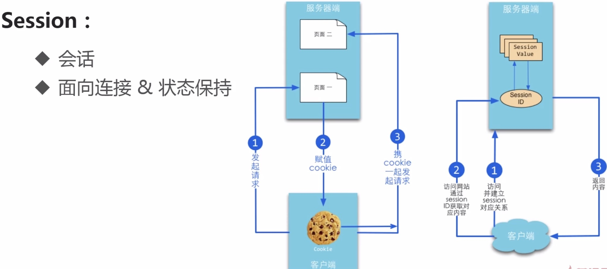

[beego文档](https://www.bookstack.cn/read/beego/install-bee.md)
 
# beego框架 #

## 1.安装beego ##

 go get github.com/astaxie/beego
  
## 2.Beego vs Gin ##

[Beego vs Gin](https://www.imooc.com/video/18638)

**beego是典型的MVC框架**

go框架|支持MVC|支持正则路由|支持session|性能
:---:|:---:|:---:|:---:|:---:
beego|支持            |支持   | 支持|低
gin  |不支持，手动编写MVC|不支持 |不支持(依赖第三方支持session包)|高

**说明**

  gin不支持session,但可以安装另外支持[session的包](github.com/astaxie/session)
  
**适用场景**

 1.beego在业务方面较gin支持的更多
 
  (1).在业务更加复杂的项目中，适用beego
  
  (2).在需要快速开发的项目中，适用beego
  
  (3).在1.0项目中，适用beego
  
 2.Gin在性能方面较beego更好
 
  (1).当某个接口的性能遭到较大挑战时，考虑使用gin重写接口
  
  (2).若项目规模不大，业务相对简单适用gin

[markdown教程](https://www.jianshu.com/p/335db5716248)
  
  
  
---------------------------------------

