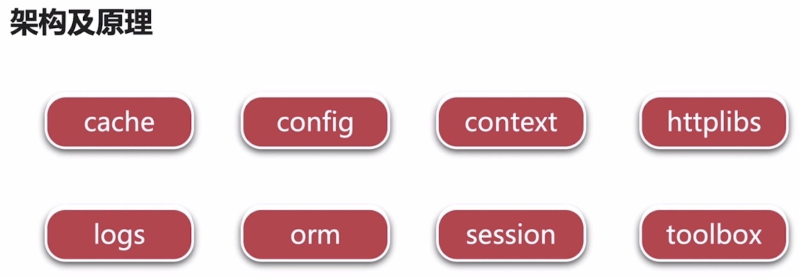

[安装beego](https://www.bookstack.cn/read/beego/install-install.md)

go get github.com/astaxie/beego

[bee工具](https://www.bookstack.cn/read/beego/install-bee.md)

1.安装bee工具:go get github.com/beego/bee

查看bee工具是否安装成功：$ bee version

2.应用bee工具创建项目:bee new myBeego

bee命令：

(1)bee new projectname:新建项目结构(必须在$GOPATH/src目录下执行)

(2)bee run :自动编译部署

(3)bee generate:自动生成代码

##beego框架介绍

###特点

快速开发 / MVC架构 / 文档齐全，社区活跃

###架构及原理

上述模块均是解耦的，beego框架模块化

1.cache:缓存

文件 /  内存   / memcache

2.config

ini:简单明了，表达力有限 / json:推荐 / xml / yaml

3.context:上下文模块

request / response

4.httplibs:模拟C端发送http请求，类似curl

支持get/post/put/delete/head

支持https

支持超时设置

支持文件上传

5.logs

多种输出引擎 / 异步输出

其他:

orm  / session / toolbox:提供运行时监控工具和定时任务工具

**注意**

bee new myBeego必须在$GOPATH/src目录下执行才有效,然后将项目导入即可

**bee工具创建目录说明**

1.conf:配置信息，设置端口等

2.controllers:C层(作为M层与V层桥梁，将M层数据绑定到V层)

3.models:M层(用于将查询的数据库数据绑定到对象，供前端使用)

4.routers:http路由

5.static:静态文件

6.tests:测试用例

7.views:视图层

8.main.go：程序入口文件

搭建商品详情页面步骤：

1。view层：将前端提供的静态文件拷备到对应目录(eg:html/css/js/img)，根据相应目录，适当修改index.html文件中目录位置.

2。model层：准备数据(模拟从数据库查询数据)

3。controller层：view与model连接的桥梁，用于将model模型数据绑定到view

**[本示例来源于mooc](https://www.imooc.com/video/18648)**

----------------

[使用beego构建完整web项目](https://www.imooc.com/video/17979)

###beego框架搭建

[安装beego](https://www.bookstack.cn/read/beego/install-install.md)

go get github.com/astaxie/beego

[bee工具](https://www.bookstack.cn/read/beego/install-bee.md)

1.安装bee工具:go get github.com/beego/bee

查看bee工具是否安装成功：$ bee version

2.应用bee工具创建项目:bee new myBeego

3.准备数据库learn,及表user

4.bee自动生成代码

$bee generate scaffold user -fields="id:int64,name:string,gender:int,age:int" -driver=mysql -conn="root:@tcp(127.0.0.1:3306)/learn"

提示：

（1）创建'user' model ->Y

 (2)创建'user' controller ->Y
 
 (3)创建'view' ->Y
 
 下方与DB相关均选择N即可
 

bee命令：

(1)bee new projectname:新建项目结构(必须在$GOPATH/src目录下执行)

(2)bee run :自动编译部署

(3)bee generate:自动生成代码

###数据库准备

创建表结构:

create table user(
id int(11) not null auto_increment,
name varchar(128) not null default ' ',
gender tinyint(4) not null default '0',
age int(11) not null default '0',
primary key(id)
)  ENGINE=InnoDB DEFAULT CHARSET=utf8;

插入测试数据

insert into user(name,gender,age) values('zhangsan',1,21);
insert into user(name,gender,age) values('lisi',0,22);
insert into user(name,gender,age) values('wangwu',1,20);
